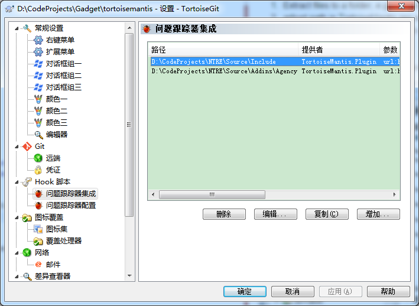
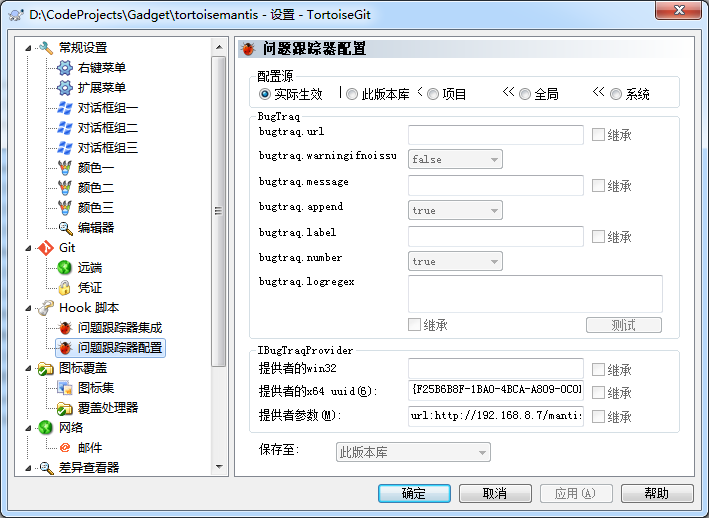

TortoiseMantis Copyright 2010 Andreas Stieger <andreas.stieger@gmx.de>

TortoiseMantis is free software: you can redistribute it and/or modify
it under the terms of the GNU General Public License as published by
the Free Software Foundation, either version 3 of the License, or
(at your option) any later version.

TortoiseMantis is distributed in the hope that it will be useful,
but WITHOUT ANY WARRANTY; without even the implied warranty of
MERCHANTABILITY or FITNESS FOR A PARTICULAR PURPOSE.  See the
GNU General Public License for more details.

You should have received a copy of the GNU General Public License
along with this program.  If not, see <http://www.gnu.org/licenses/>.

TortoiseMantis is an issue tracker plugin for using MantisBT with TortoiseSVN. It implements the IBugtraqProvider interface. 

Features
========

* filtering of own issues / all issues
* column sorting
* keyword/id search
* press ESC to cancel
* When filter shows only one issue, RETURN selects it

Requirements
============

Known working configuration:
* TortoiseSVN 1.6.10 OR TortoiseGit 1.8.14.0
* Windows XP 32 bit OR Windows 7 64 bit
* MantisBT 1.2.2 OR 1.2.19

Known *NOT* working:
* Mantis BT 1.1.2

Installation from binary
========================

1. Extract files to a folder, e.g. C:\Program Files\TortoiseMantis  
2. adjust path in TortoiseMantis.reg accordingly and merge the registry file (double click)  
3. TortoiseSVN / right click / Settings / Hook Scripts / Issue Tracker Integration  
* Click add and fill form.   
  
   Sample configuration line: 
url:http://127.0.0.1/bugs-test/api/soap/mantisconnect.php username:foouser password:foopass

* Add global setting

UUID:  
{F25B6B8F-1BA0-4BCA-A809-0C0B6F4A0CED}
configuration:  
url:http://127.0.0.1/bugs-test/api/soap/mantisconnect.php username:foouser password:foopass
4. In commit dialog, click "Choose issue"

Installation from source
========================

1. Build
2. run do-registry-thingie.cmd
3. add TortoiseMantis.reg to your registry. This will reference the Release binary you just built

Known Issues
============

* Does not support MantisBT 1.1.2, it's a MantisBT bug
* slow startup due to xml parser initialisation

TODO
====

* IBugtraqProvider2
* more configuration options
* installer